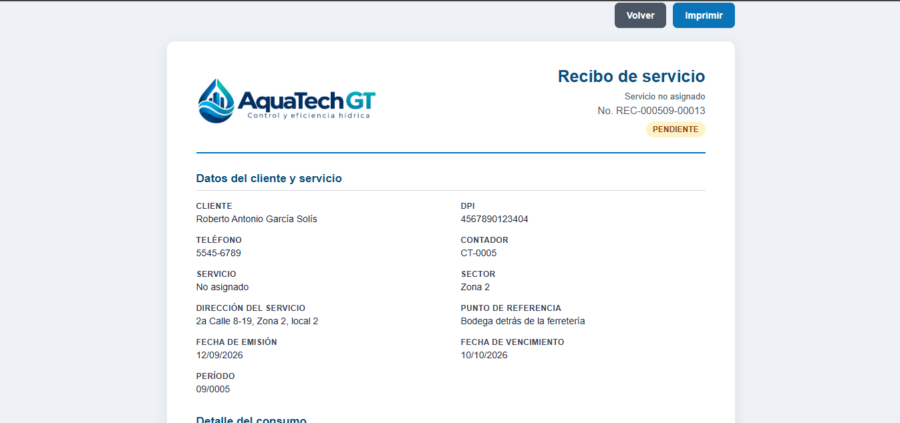
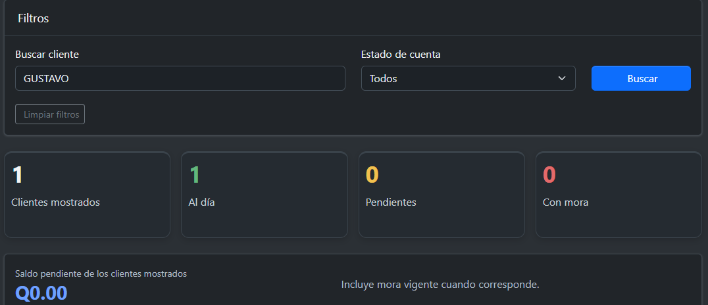
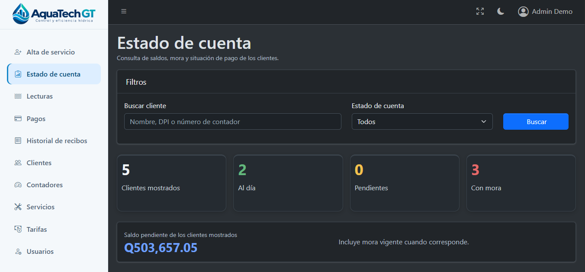

# Manual de Usuario

Esta guía explica, en lenguaje sencillo, cómo usar el sistema según tu rol. No necesitas conocimientos técnicos para seguirla.

## ¿Quién puede hacer qué?

| Rol | Puede hacer |
|---|---|
| **Administrador** | Todo: usuarios, clientes, contadores, tarifas, lecturas |
| **Secretaria** | Clientes, contadores, tarifas, lecturas, ver estado de cuenta, pagos |
| **Lector** | Registrar y consultar lecturas |

Si intentas entrar a una sección que no te corresponde, el sistema te va a mostrar un mensaje de "No tiene permisos" — eso es normal, no es un error, simplemente esa parte no es para tu rol.

## Iniciar sesión

1. Abre la dirección del sistema en tu navegador.
2. Escribe tu correo y tu contraseña.
3. Presiona **Iniciar sesión**.

**Si te sale "Las credenciales ingresadas son incorrectas o el usuario está inactivo":** revisa que estés escribiendo bien tu correo y contraseña. Si estás seguro de que están bien, avisa al Administrador — puede que tu usuario esté desactivado.

---

## Cómo registrar un cliente nuevo

*(Para Administrador y Secretaria)*

1. En el menú lateral, entra a **Clientes**.

  

2. Presiona el botón **+ Nuevo Cliente**

3. Llena el formulario:
   - **Nombre** completo del cliente.
   - **DPI** — obligatorio, y no puede repetirse entre dos clientes.
   - **Teléfono** (opcional).
   - **Dirección principal** (opcional).

4. Presiona **Guardar**. Si todo está correcto, vuelves al listado y el cliente nuevo aparece ahí.

**Si el sistema no te deja guardar:** casi siempre es porque el DPI que escribiste ya pertenece a otro cliente registrado. Verifica el número.

---

## Cómo registrar un contador
 
*(Para Administrador y Secretaria — se necesita antes de poder tomar lecturas)*
 
1. En el menú lateral, entra a **Contadores**.
2. Presiona el botón **+ Nuevo Contador**.
  

3. Llena el formulario:
   - **Cliente** — a quién pertenece este contador (solo aparecen clientes activos).
   - **Tarifa** — obligatoria. Es el tipo de servicio contratado (1/2 paja, 1 paja, 2 pajas); de aquí sale el precio que se va a usar en cada recibo.
   - **Servicio** (opcional) — una clasificación informativa, no afecta el cobro.
   - **Número de registro** — el identificador físico del contador (ejemplo: `CONT-001`).
   - **Dirección de servicio** y/o **Punto de referencia** — al menos uno de los dos es necesario para poder ubicar el contador (ejemplo de referencia: "Casa verde, frente a la iglesia").
   - **Sector** (opcional).
   - **Lectura inicial** (opcional) — si ya sabes cuánto marca el contador físicamente al momento de darlo de alta, anótalo aquí; si no, se puede dejar en blanco.
   - **Foto** (opcional) — una imagen del contador o del lugar, para ubicarlo más fácil en el futuro.
4. Presiona **Guardar**.
**Si el sistema no te deja guardar:** revisa que el número de registro no esté repetido, y que hayas puesto al menos una dirección o un punto de referencia.
 
---

## Cómo tomar una lectura

*(Para Lector — Administrador y Secretaria también pueden consultarlas)*

1. En el menú lateral, entra a **Lecturas**.
2. Presiona **+ Registrar Lectura**.

3. En el primer paso, elige el **contador** de la lista desplegable. En cuanto lo eliges, la pantalla se actualiza sola y te muestra:
   - El cliente al que pertenece.
   - Su dirección.
   - La **última lectura registrada** (o "0" si es la primera vez que se toma).

4. Completa:
   - **Período** — el mes al que corresponde esta lectura.
   - **Lectura actual** — el número que marca el contador en este momento.
   - **Observación** (opcional) — cualquier nota, por ejemplo si el contador está dañado.

5. Presiona **Guardar lectura**.

Al guardar, el sistema **genera automáticamente el recibo** de ese período — no es un paso aparte. El mensaje de confirmación te va a mostrar el número de recibo generado (por ejemplo, `REC-2026-4821-000001`), listo para consultarse e imprimirse.

**Si el sistema no te deja guardar:**
- *"La lectura actual no puede ser menor a la lectura anterior"* — revisa el número que escribiste; un contador de agua nunca retrocede.
- *"Ya existe una lectura registrada para este contador en este período"* — ese contador ya se registró este mes. No se puede repetir.

---
 
## Cómo consultar e imprimir un recibo
 
*(Lector: puede imprimir el recibo recién generado. Administrador y Secretaria: pueden consultar todo el historial.)*
 
1. En el menú lateral, entra a **Recibos**.
   

2. *(Solo Administrador y Secretaria)* Puedes buscar por número de recibo, DPI, nombre del cliente o número de contador, y filtrar por período o por estado (**Pendiente**, **Pagado**, **Anulado**).
   

3. Selecciona un recibo para abrir la versión imprimible.
   

Si el recibo todavía está **pendiente** y ya se pasó la fecha de vencimiento, el recibo va a mostrar los días de atraso y el monto de mora ya sumado al total. Si el recibo ya está **pagado**, la misma pantalla funciona como comprobante de pago.
**Nota:** el Lector solo puede abrir el recibo puntual que se generó al guardar su lectura (por ejemplo, para imprimirlo en el momento en campo) — el historial completo de búsqueda es solo para Administrador y Secretaria.

---

## Cómo registrar un pago
 
*(Para Administrador y Secretaria)*
 
1. En el menú lateral, entra a **Pagos**. Aquí solo aparecen los recibos que todavía están **pendientes** — los ya pagados o anulados no salen en esta lista.

2. Busca el recibo (por número de recibo, cliente, DPI o número de contador) y presiona **Registrar pago** en la fila correspondiente.
 
 

3. En la pantalla de cobro verás el detalle del recibo, incluyendo la mora si el pago ya está atrasado. Elige el **método de pago** y, si quieres, agrega una **referencia** (por ejemplo, número de boleta) y una **observación**.
 
 

4. Presiona **Registrar pago**. El sistema calcula el monto final por su cuenta (no se puede editar a mano) y marca el recibo como **Pagado**. Te va a llevar directo al recibo, que ahora funciona como comprobante.
**Si el sistema no te deja registrar el pago:**
- *"Este recibo ya fue pagado"* — alguien más ya lo cobró; revisa el estado antes de intentar de nuevo.
- *"El recibo está anulado"* — un recibo anulado no puede recibir pagos.
---
 
## Cómo ver el estado de cuenta de un cliente

*(Para Administrador y Secretaria)*

1. En el menú lateral, entra a **Dashboard** o **Estado de cuenta**.

2. Puedes buscar un cliente específico escribiendo su nombre, o filtrar por estado:
   - **Al día** — no tiene ningún recibo pendiente de pago.
   - **Pendiente** — tiene recibos por pagar, pero ninguno está atrasado.
   - **Con mora** — tiene al menos un recibo pendiente que ya se pasó de la fecha de pago.

Cada fila te muestra cuánto debe el cliente en total, incluyendo el recargo por mora si aplica.

---

## Preguntas frecuentes

**¿Por qué no veo el botón para eliminar una lectura?**
Las lecturas no se pueden editar ni eliminar una vez guardadas — es intencional, para no perder el historial real de consumo.

**Registré mal una lectura, ¿qué hago?**
Avisa al Administrador; por ahora esa corrección se hace directo en la base de datos, no desde una pantalla.

**¿Por qué un cliente aparece "Con mora" si ya pagó?**
Revisa que el pago se haya registrado correctamente contra ese recibo específico. Si el problema persiste, avisa al Administrador.
